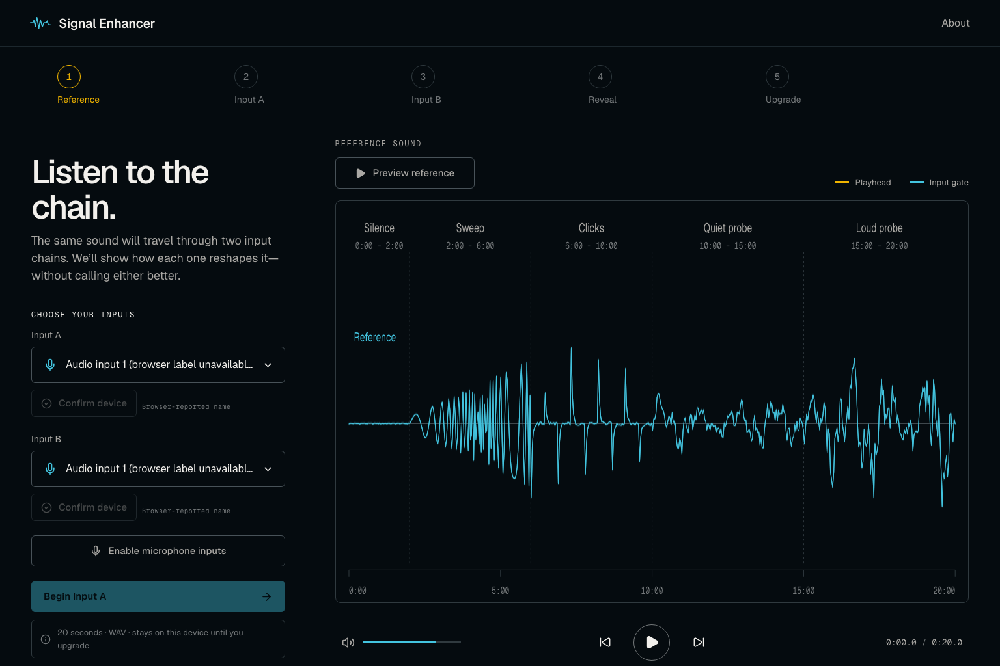
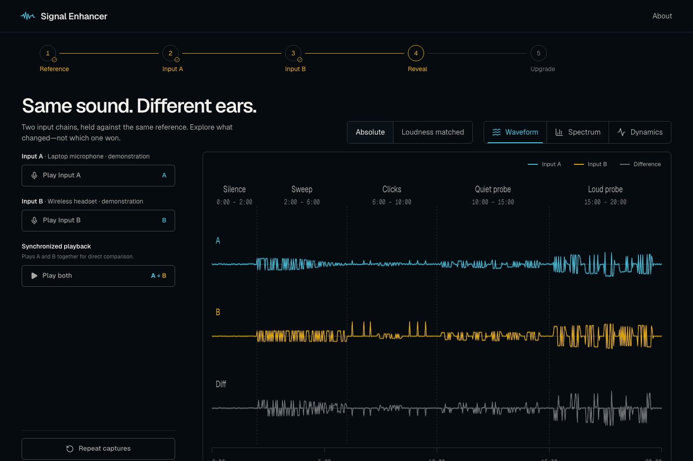
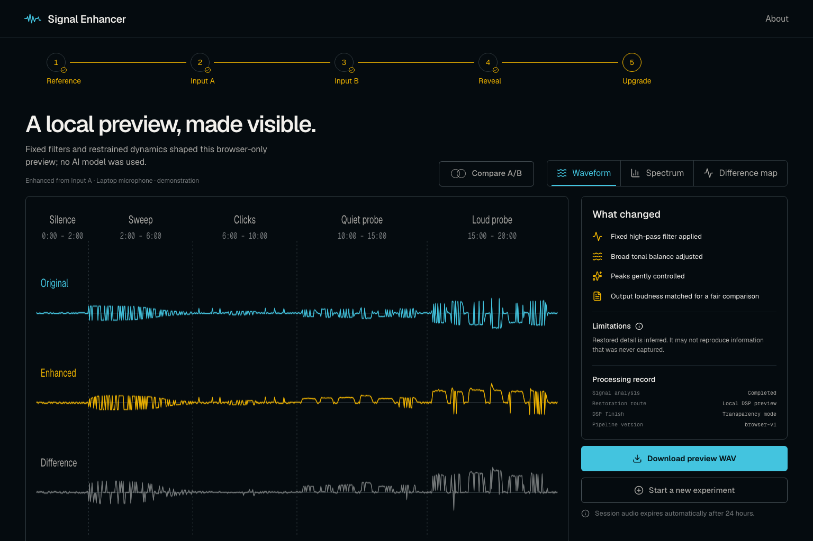
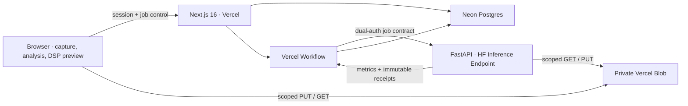

# Signal Enhancer

One sound, two input chains, one visual comparison, one honest signal upgrade.

Signal Enhancer is a guided browser audio experiment. It records the same deterministic 20-second reference through Input A and Input B, reveals how the two capture chains differ, and offers one transparent upgrade path for Input A. It never ranks hardware, claims access to a “raw” signal, or presents inferred detail as recovered fact.

The public deployment starts in **safe demo mode**: the complete prepared comparison and local DSP journey work without cloud audio processing. Live mode is already separated behind fail-closed server configuration for private storage, durable jobs, and the Hugging Face worker.

## Product surface

- Exact 20-second, versioned mono diagnostic reference
- Browser device discovery, confirmation, and sequential AudioWorklet capture
- Waveform, spectrum, dynamics, noise-floor, absolute, loudness-matched, and difference views
- Synchronized A/B transport and cautious, non-ranking observations
- Honest browser-only DSP preview
- One durable deep-upgrade job per anonymous signed session
- Private, object-scoped uploads and downloads with 24-hour expiry
- Truthful backend-emitted progress—never a fabricated percentage

Verified production implementation:

| Setup                                                          | Reveal                                                           | Upgrade result                                                                   |
| -------------------------------------------------------------- | ---------------------------------------------------------------- | -------------------------------------------------------------------------------- |
|  |  |  |

The five original image-generation concepts remain in [`docs/design`](docs/design). The native viewport comparisons, intentional product-honesty differences, and verified interactions are recorded in [FIDELITY_LEDGER.md](docs/FIDELITY_LEDGER.md). The complete product contract is in [PRODUCT_SPEC.md](docs/PRODUCT_SPEC.md), the visual system in [DESIGN_SYSTEM.md](docs/DESIGN_SYSTEM.md), and the technical decisions in [ARCHITECTURE.md](docs/ARCHITECTURE.md).

## Architecture



Audio bytes do not pass through ordinary Vercel Functions. The browser uploads directly to a dedicated private Blob store. The workflow warms the worker before minting five-minute input/result URLs, and the worker accepts only exact allowlisted Blob hosts and attempt-scoped paths.

## Local demo

Requirements: Node 24 and npm 11.

```bash
nvm use
npm ci
cp .env.example .env.local
npm run dev
```

Open `http://localhost:3000`, choose **About**, then **Explore a prepared comparison**. With the default `SIGNAL_MODE=demo`, microphone audio stays in the browser and the result is explicitly labelled as a non-AI local DSP preview.

## Quality gates

```bash
npm run format:check
npm run lint
npm run typecheck
npm test
npm run build
npm run test:e2e
```

The Python 3.12 worker has a separately locked environment:

```bash
uv sync --directory worker --extra dev --frozen
uv run --directory worker ruff check .
uv run --directory worker mypy
uv run --directory worker pytest
docker build --file worker/Dockerfile --tag signal-enhancer-worker:local worker
```

GitHub Actions runs both stacks and builds the deterministic non-root worker image on every change. The local machine used for the initial foundation did not expose a Docker daemon, so CI is the first container-build gate.

## Live environment

Keep `SIGNAL_MODE` and `NEXT_PUBLIC_SIGNAL_MODE` aligned. Live mode requires all of the following:

| Variable                                                 | Purpose                                                         |
| -------------------------------------------------------- | --------------------------------------------------------------- |
| `SESSION_SIGNING_SECRET`                                 | Signs anonymous 24-hour session cookies; at least 32 characters |
| `NETWORK_HASH_SECRET`                                    | HMACs coarse abuse-control identifiers; at least 32 characters  |
| `DATABASE_URL`                                           | Neon Postgres connection from the Vercel Marketplace            |
| `BLOB_READ_WRITE_TOKEN` or Vercel OIDC + `BLOB_STORE_ID` | Server authority for a dedicated private Blob store             |
| `CRON_SECRET`                                            | Authenticates the hourly expiry cleanup; at least 32 characters |
| `HF_ENDPOINT_URL`                                        | Protected custom Inference Endpoint base URL                    |
| `HF_ENDPOINT_TOKEN`                                      | Hugging Face gateway bearer token                               |
| `HF_ENDPOINT_SHARED_SECRET`                              | Independent app-to-worker secret; at least 32 UTF-8 bytes       |

Generate secrets with a cryptographically secure tool, for example `openssl rand -hex 32`. Never expose server variables with a `NEXT_PUBLIC_` prefix.

After provisioning Neon, apply the checked-in migration once:

```bash
npm run db:migrate
```

For Vercel, connect this GitHub repository, create an EU Neon database and a dedicated **private** Blob store, set the production variables, and deploy from `main`. The committed `vercel.json` selects `dub1`, enables request cancellation for the resumable stream route, and runs a daily authenticated housekeeping pass that fits the current Hobby demo account.

Before enabling live capture, schedule `/api/internal/cleanup` at least hourly—either with Vercel Pro Cron or an authenticated external scheduler—so objects that reach their 24-hour expiry are removed promptly. The current demo never uploads server-side audio, so its daily task only performs no-op housekeeping.

## Hugging Face worker

The service contract and deployment detail live in [worker/README.md](worker/README.md). Production uses a custom `linux/amd64` image and the pinned Resemble Enhance source/model revisions recorded there.

Recommended beta endpoint settings:

- AWS `eu-west-1`, NVIDIA L4
- minimum replicas `0`, maximum replicas `1`
- `SIGNAL_ENGINE=resemble`
- immutable `SIGNAL_BUILD_REVISION`
- `SIGNAL_ENDPOINT_SECRET` equal to the Vercel `HF_ENDPOINT_SHARED_SECRET`
- `SIGNAL_ALLOWED_STORAGE_HOSTS=<store-id>.private.blob.vercel-storage.com,blob.vercel-storage.com`
- `ResembleAI/resemble-enhance@4e3510ce4a8391159f665903544c5150bee7b2cb` mounted at `/repository/enhancer_stage2`

The protected HF gateway bearer and application secret are independent. Endpoint creation can incur GPU charges, so it is intentionally a deliberate promotion after the image is published and billing limits are confirmed—not part of an unattended first deploy.

## Privacy and security

- No microphone bytes leave the browser until **Upgrade Signal** is pressed.
- Captures and derivatives use private, short-lived, object-scoped Blob URLs.
- Live sessions, captures, results, and reports expire after 24 hours; the authenticated cleanup route deletes artifacts before cascading database records.
- Signed URLs, credentials, and request bodies are excluded from application logs.
- Input size, duration, MIME, object path, hash, RIFF structure, codec, channel count, and decoded samples are validated at successive trust boundaries.
- Global daily and active-job caps are reserved transactionally before GPU work.

See [SECURITY.md](SECURITY.md) for reporting and operational boundaries.

## Repository map

```text
src/app/                 Next.js UI and route handlers
src/components/          Product-native lab interface
src/lib/audio/           Capture, WAV, analysis, comparison, local DSP
src/lib/server/          Contracts, auth, storage, database repositories
src/lib/workflows/       Durable upgrade orchestration
worker/                  Hugging Face FastAPI worker and tests
migrations/              Explicit Postgres schema
docs/                    Product, design, architecture, concepts
tests/e2e/               Deployed/local browser journey
```

This repository is currently proprietary and private. Third-party notices for the optional restoration model are preserved in [worker/THIRD_PARTY_NOTICES.md](worker/THIRD_PARTY_NOTICES.md).
