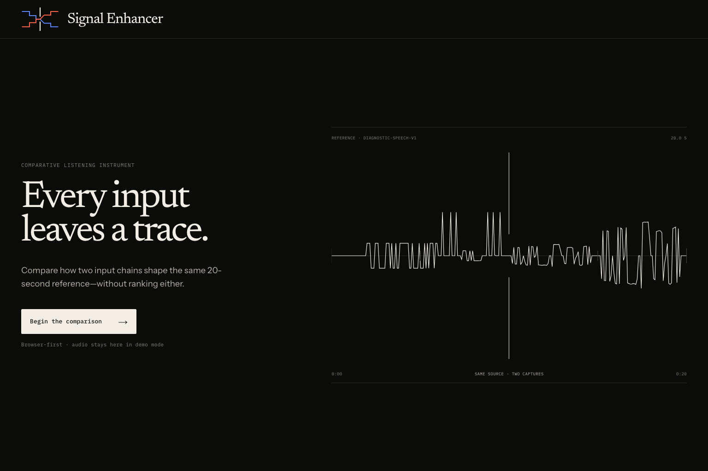
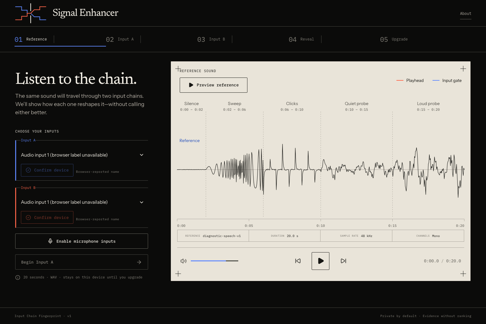
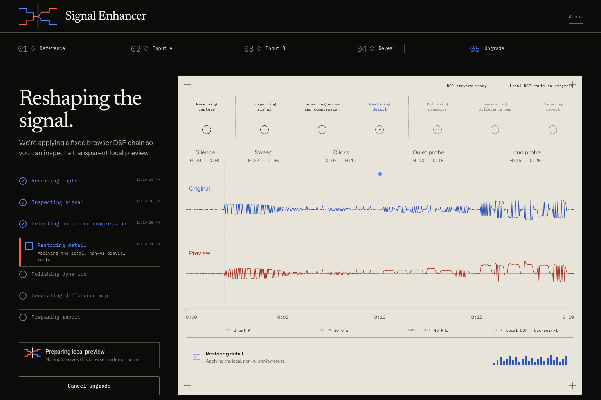
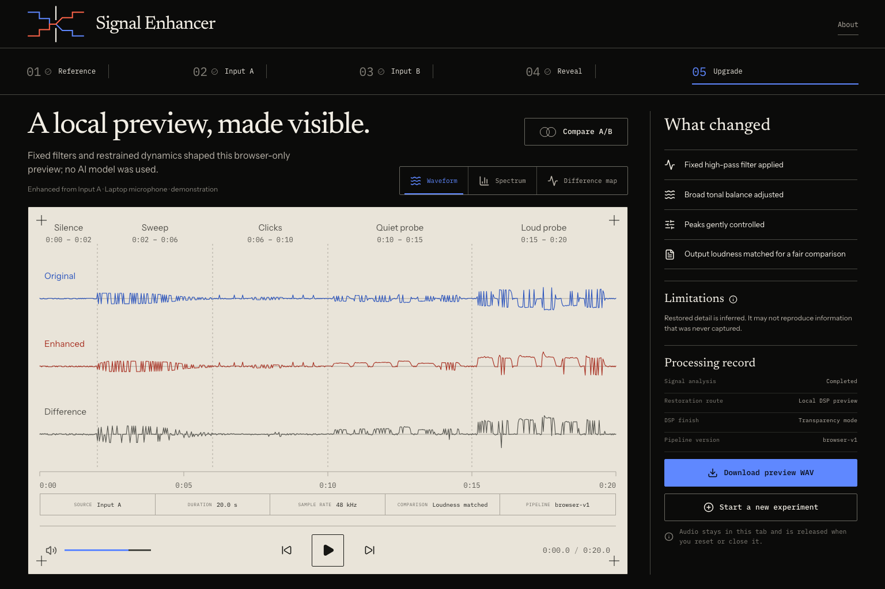
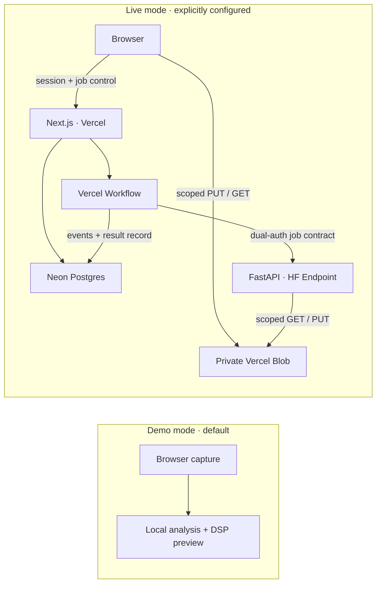

<div align="center">
  

  <h1>Signal Enhancer</h1>
  <p><strong>Every input leaves a trace.</strong></p>
  <p>A calibrated editorial instrument for seeing how two audio input chains shape the same sound.</p>
</div>



Signal Enhancer guides one deterministic 20-second reference through Input A and Input B, then turns their differences into inspectable evidence. It offers a restrained browser-only DSP preview and an opt-in path to deeper speech restoration without ranking hardware, promising a “raw” signal, or presenting inferred detail as recovered fact.

> [!NOTE]
> Signal Enhancer is in public preview. The default configuration is the safe, browser-only demo. This repository is publicly readable but remains proprietary; no open-source license is granted.

## One experiment, held to one standard

- Play the same versioned reference through two sequential capture chains.
- Compare waveform, spectrum, dynamics, noise floor, loudness-matched traces, and the A/B difference.
- Read cautious observations that describe what changed without declaring a winner.
- Preview a transparent, non-AI local DSP pass.
- In an explicitly configured live environment, run one durable deep-upgrade job while the backend records its route, measurements, versions, and enhanced-WAV hash.

The phase-aperture mark expresses that method: two equal traces approach a narrow capture plane and leave with a visible relationship. The interface follows the same principle—mineral black around one warm measurement surface, ultramarine and vermilion reserved for A/B identity, and provenance shown as part of the instrument rather than hidden in decorative chrome.

## Demo and live mode are intentionally different

|                         | Safe demo — default                                                       | Live cloud path — opt-in                                                                                                |
| ----------------------- | ------------------------------------------------------------------------- | ----------------------------------------------------------------------------------------------------------------------- |
| Processing              | Deterministic analysis and restrained DSP in the browser                  | Durable orchestration plus a protected Hugging Face worker                                                              |
| Audio movement          | Microphone audio stays in the browser, including after **Upgrade Signal** | Audio uploads only after **Upgrade Signal** is pressed                                                                  |
| Infrastructure required | None beyond the Next.js app                                               | Neon Postgres, a dedicated private Vercel Blob store, Vercel Workflow, and a custom HF Inference Endpoint               |
| Result language         | Explicitly labelled local preview; no AI model claim                      | Enhanced playback with disclosed limitations; the backend retains route, version, measurement, and result-hash metadata |
| Failure posture         | Fully usable prepared comparison and local journey                        | Fails closed when any required secret or service is absent                                                              |

Making the repository public or deploying the web app does **not** activate live processing. Both `SIGNAL_MODE` and `NEXT_PUBLIC_SIGNAL_MODE` must be set to `live`, and every server-side dependency must pass validation.

## Product surface

- Exact, versioned, mono diagnostic reference
- Browser device discovery, confirmation, and sequential AudioWorklet capture
- Synchronized A/B transport with absolute and loudness-matched views
- Code-native signal plots with text summaries and non-color identifiers
- Truthful named processing stages—never a fabricated percentage or ETA
- One deep upgrade per anonymous signed session in live mode
- Private, object-scoped uploads and downloads with 24-hour artifact expiry

Implementation evidence, captured from the current local production-mode build:

| Reference and setup                                                                      | Transparent processing                                                                                      | Upgrade result                                                                                       |
| ---------------------------------------------------------------------------------------- | ----------------------------------------------------------------------------------------------------------- | ---------------------------------------------------------------------------------------------------- |
|  |  |  |

The responsive implementation is documented in the [brand fidelity ledger](docs/brand-redesign/FIDELITY_LEDGER.md), including the native mobile capture and the deliberate differences between concept art and runtime evidence.

## Architecture

The default demo has no cloud audio path. Live mode adds a separate control plane and private data plane:



Audio bytes never transit an ordinary Vercel Function. The browser uploads directly to a dedicated private Blob store. After both captures are committed and job capacity is reserved atomically, the workflow warms the worker before issuing five-minute input and result grants. The worker accepts only exact allowlisted HTTPS hosts and attempt-scoped paths.

Read [Architecture](docs/ARCHITECTURE.md) for the complete request flow, data model, trust boundaries, quotas, and deployment decisions.

## Run the safe demo locally

Requirements: Node.js 24 and npm 11.

```bash
nvm use
npm ci
cp .env.example .env.local
npm run dev
```

Open `http://localhost:3000` and choose **Begin the comparison** to enter `/lab`. In the lab, choose **About**, then **Explore a prepared comparison** for the deterministic no-permission path, or record two inputs locally. The example environment keeps `SIGNAL_MODE=demo`, so neither path sends microphone audio to a server.

## Quality gates

Run the complete web gate before proposing a change:

```bash
npm run format:check
npm run lint
npm run typecheck
npm test
npm run build
npm run test:e2e
```

The Python 3.12 worker has its own locked environment:

```bash
uv sync --directory worker --extra dev --frozen
uv run --directory worker ruff check .
uv run --directory worker mypy
uv run --directory worker pytest
docker build --file worker/Dockerfile --tag signal-enhancer-worker:local worker
```

GitHub Actions runs both stacks and builds the non-root worker image from the committed lockfile on every pull request and every push to `main`.

## Configure live mode deliberately

Live mode requires all of the following server-side values. Leave them unset in demo environments.

| Variable                                                 | Purpose                                                          |
| -------------------------------------------------------- | ---------------------------------------------------------------- |
| `SESSION_SIGNING_SECRET`                                 | Signs anonymous 24-hour session cookies; at least 32 characters  |
| `NETWORK_HASH_SECRET`                                    | HMACs coarse abuse-control identifiers; at least 32 characters   |
| `DATABASE_URL`                                           | Neon Postgres connection                                         |
| `BLOB_READ_WRITE_TOKEN` or Vercel OIDC + `BLOB_STORE_ID` | Server authority for a dedicated private Blob store              |
| `CRON_SECRET`                                            | Authenticates artifact expiry cleanup; at least 32 characters    |
| `HF_ENDPOINT_URL`                                        | Protected custom Inference Endpoint base URL                     |
| `HF_ENDPOINT_TOKEN`                                      | Hugging Face gateway bearer token                                |
| `HF_ENDPOINT_SHARED_SECRET`                              | Independent application-to-worker secret; at least 32 characters |

Generate secrets with a cryptographically secure tool, such as `openssl rand -hex 32`. Never expose a server secret with a `NEXT_PUBLIC_` prefix. Keep `SIGNAL_MODE` and `NEXT_PUBLIC_SIGNAL_MODE` aligned, provision all integrations in the same intended environment, and apply the checked-in schema once:

```bash
npm run db:migrate
```

Live launch additionally requires an hourly-or-faster authenticated call to `/api/internal/cleanup`. The committed Hobby-compatible demo schedule is daily because demo mode stores no server audio. See the [worker deployment guide](worker/README.md) before provisioning a paid endpoint; endpoint creation can incur GPU charges and is intentionally separate from an ordinary Vercel deployment.

## Privacy and security

- No microphone bytes leave the browser until the user presses **Upgrade Signal**; in demo mode they never leave it.
- Live capture grants are private, object-scoped, non-overwriting, bounded by session expiry, and limited to at most two immutable path attempts per input slot.
- Live result grants are private, attempt-scoped, non-overwriting, and short-lived.
- Live sessions, captures, results, and reports expire after 24 hours.
- On each authenticated cleanup pass, every tracked object path is deleted after expiry; discovery records remain through a 15-minute write-drain window before expired database rows cascade.
- Signed URLs, credentials, request bodies, and captured audio are excluded from application logs.
- Size, duration, MIME, object path, hash, RIFF structure, codec, channel count, and decoded samples are validated at successive trust boundaries.
- Global daily and active-job capacity is reserved atomically after both captures commit and before the enhancement workflow or inference begins.

Report vulnerabilities privately by following the [security policy](SECURITY.md). Never put credentials, signed media URLs, or captured audio in a public issue.

## Documentation

Start with the [documentation index](docs/README.md).

| Document                                                        | What it defines                                                    |
| --------------------------------------------------------------- | ------------------------------------------------------------------ |
| [Product specification](docs/PRODUCT_SPEC.md)                   | Canonical journey, product claims, privacy, and deferred scope     |
| [Architecture](docs/ARCHITECTURE.md)                            | Web, storage, workflow, worker, and deployment contracts           |
| [Brand research](docs/brand-redesign/BRAND_RESEARCH.md)         | Competitive study, voice, and differentiation                      |
| [Brand System v2](docs/brand-redesign/BRAND_SYSTEM_V2.md)       | Phase-aperture identity, palette, type, layout, motion, and copy   |
| [Brand fidelity ledger](docs/brand-redesign/FIDELITY_LEDGER.md) | Concept-to-code evidence and interaction verification              |
| [Worker guide](worker/README.md)                                | FastAPI contract, local checks, image, and endpoint settings       |
| [Contributing](CONTRIBUTING.md)                                 | Issue policy, paused code PRs, quality, privacy, and accessibility |

## Repository map

```text
src/app/                 Next.js UI and route handlers
src/components/          Product-native lab interface
src/lib/audio/           Capture, WAV, analysis, comparison, local DSP
src/lib/server/          Contracts, auth, storage, database repositories
src/lib/workflows/       Durable upgrade orchestration
worker/                  Hugging Face FastAPI worker and tests
migrations/              Explicit Postgres schema
docs/                    Product, architecture, brand, and evidence
tests/e2e/               Desktop and mobile browser journeys
```

## Source status

This is a public source repository, not an open-source release. Signal Enhancer remains proprietary and no license is granted to use, copy, modify, distribute, or sublicense the code except with explicit permission or as otherwise permitted by law. Third-party components retain their own licenses; notices for the optional restoration model are preserved in [worker/THIRD_PARTY_NOTICES.md](worker/THIRD_PARTY_NOTICES.md).

Issues and carefully scoped proposals are welcome. Code pull requests are paused until contributor terms are published; read [CONTRIBUTING.md](CONTRIBUTING.md) before proposing a change.
