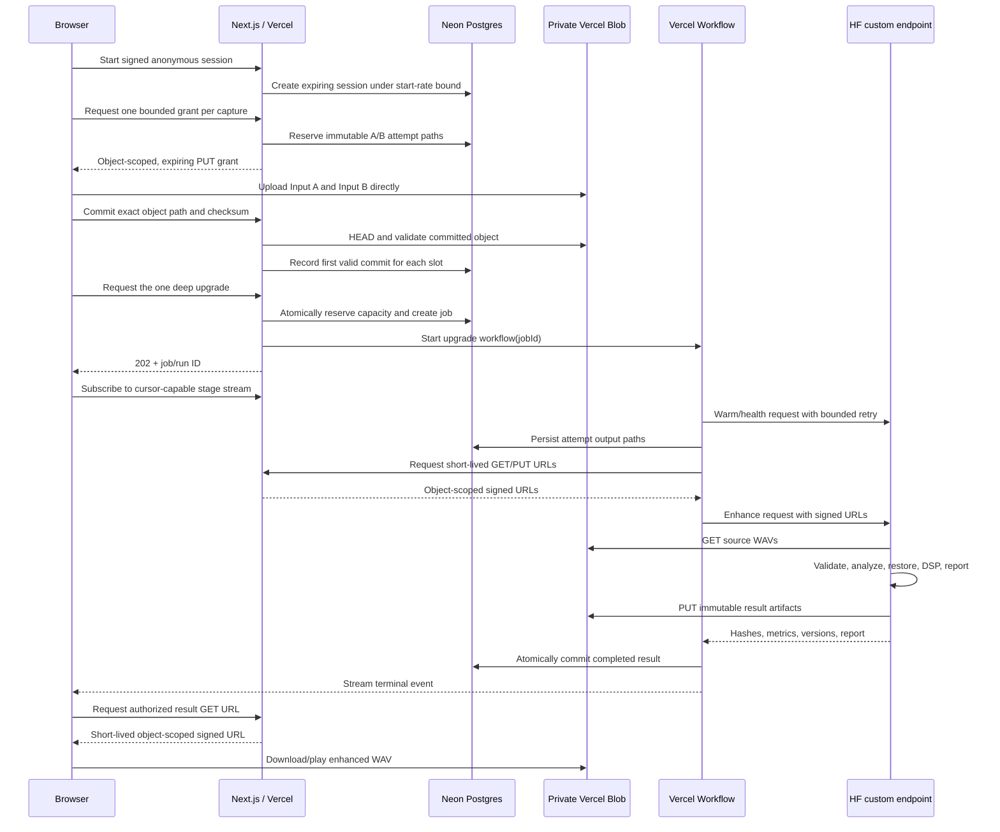

# Signal Enhancer — Architecture

## Decision summary

Signal Enhancer uses a monorepo-shaped repository with two deployable surfaces:

- **Next.js 16 App Router on Vercel** for the product UI, capture orchestration, private upload authorization, durable workflow, status stream, quota enforcement, and result delivery.
- **A custom FastAPI container on Hugging Face Inference Endpoints** for versioned audio analysis, speech restoration, restrained DSP, and result generation.

The planned first live placement is Europe:

- Vercel Functions/Workflow: `dub1` where configurable;
- Vercel Blob: an EU private store;
- Neon Postgres through the Vercel Marketplace in an EU region;
- Hugging Face Inference Endpoint: AWS `eu-west-1`.

## Request and data flow

Audio bytes never transit an ordinary Vercel Function.

## Web stack

- Next.js `16.2.12`, React `19.2.8`, Node `24.x` in production.
- TypeScript with strict mode and exact contracts validated by Zod.
- CSS custom properties and a small global component-class layer for the visual system; no runtime styling dependency.
- Server Components by default; client boundaries are limited to media capture, Web Audio, SVG signal plots, and workflow state.
- Vitest for unit/integration tests and Playwright for the browser journey.
- `workflow` DevKit for durable multi-step orchestration and resumable progress streams.

Versions are pinned in the lockfile. “Latest” never means floating production dependencies.

## Browser audio subsystem

- `navigator.mediaDevices.getUserMedia()` and `enumerateDevices()` for permission and device discovery.
- Requested constraints are conservative; actual `MediaStreamTrack.getSettings()` values are displayed separately.
- One `AudioContext` and deterministic decoded reference buffer are reused across both captures.
- A versioned `AudioWorklet` records PCM without blocking the main thread; bounded browser helpers encode mono RIFF/WAVE and calculate analysis frames.
- Absolute and loudness-matched traces are derived independently so normalized comparison never replaces the original evidence.
- The browser computes the first reveal before any upload.
- A deterministic typed-array DSP chain produces a clearly labelled local preview after Upgrade Signal is pressed.

## Private object storage

Use a dedicated private Vercel Blob store. Signed URLs introduced in 2026 allow object- and operation-scoped access without sharing the store-wide token.

- Capture PUT URL: one immutable attempt pathname, `audio/wav`, exact maximum size, at most 10 minutes, and never beyond session expiry. Each A/B slot may reserve at most two tracked path attempts; overwrite and random suffixes are disabled.
- A matching outstanding path may receive at most two successful authorizations. A changed capture, or one whose current path has exhausted that bound, may claim the second path when it remains available. Once matching audio is committed, the same request returns that receipt without issuing another grant. No grant can overwrite an object, and the first valid commit permanently owns the slot.
- Worker input and result GET URLs: one exact pathname, at most five minutes, and bounded by job expiry. Internal commit HEAD grants are five minutes and are issued only after a current session-ownership and expiry check.
- Result PUT URL: deterministic attempt-scoped pathname, persisted on the job before any five-minute write grant is issued.
- Result artifacts remain immutable per processing attempt; overwrite and random suffixes are disabled.
- An authoritative `HEAD` verifies committed size and any returned MIME metadata before the job starts; the worker then performs bounded RIFF/WAVE validation before inference.
- Cleanup enumerates both bounded A/B attempt paths, every stored grant/commit path, and the persisted result, difference, and report paths. Objects become eligible for deletion after session expiry; database discovery records remain for a 15-minute write-drain window before cascade so a later cleanup pass can retry interrupted deletion.
- Live launch requires an hourly-or-faster scheduler. The safe Hobby demo uses daily no-op housekeeping because it stores no server audio.
- Never log signed URLs, Blob tokens, or request bodies.

Initial maximum WAV size is 4 MiB for a 20-second mono 48 kHz PCM16 clip plus safe overhead. Server validation rejects non-WAV content even when MIME and filename appear valid.

## Durable jobs and status

Vercel Workflow owns orchestration because the process is multi-step, retryable, and must survive page reloads and deployments. Neon remains the product source of truth.

Job states:

`queued → warming → processing → completed`

Terminal states:

`failed | expired | cancelled`

Workflow events carry a monotonically increasing sequence, one of the seven named product stages, or a sanitized terminal failure. `GET /api/upgrades/:runId/events` serves NDJSON and accepts an optional `startIndex` cursor. The current browser opens one stream, then reads final state and the authorized result from `GET /api/upgrades/:runId` after a normal stream close; automatic reconnect remains future work.

The status route exposes stored result metadata to an authorized session. The current interface consumes the enhanced WAV and shows a restrained generic processing record, but it does not yet render the raw backend metadata as a detailed receipt.

Workflow step rules:

- Progress events publish only safe metadata. Audio bytes never enter workflow state, and short-lived signed grants remain confined to service-to-service job payloads.
- Job reservation is uniquely constrained to one job per session and output paths are immutable per attempt.
- A transaction and advisory lock serialize global quota reservation.
- Retry network failures and HTTP 429/502/503 with capped backoff.
- Treat malformed audio, schema errors, and other deterministic 4xx responses as fatal.
- The workflow records one terminal result or one sanitized failure for the session-scoped job.
- Cancellation is best effort. A running inference may finish after cancellation, so endpoint concurrency remains capped during preview.

## Data model

### `experiment_sessions`

- `id`, `public_id`, `status`
- signed-session hash and coarse abuse key hash
- reference sample ID/version
- Input A/B reported and user-confirmed device metadata
- capture-constraint metadata
- created/updated/expiry timestamps

### `capture_upload_grants`

- session ID and `A | B` slot
- attempt `1 | 2` and immutable Blob pathname
- expected bytes and SHA-256
- authorization and verification counters, each bounded from zero through two
- created/expiry timestamps

### `captures`

- one committed row per session and `A | B` slot
- immutable Blob pathname, bytes, SHA-256
- codec, duration, sample rate, channels
- browser-computed capture metrics JSON
- created/expiry timestamps

### `upgrade_jobs`

- session ID, workflow run ID, state, attempt count
- selected source (`A` in v1)
- routing decision; persisted result, report, and difference Blob pathnames
- enhanced-WAV SHA-256
- before/after/Input B measurements and pipeline/model versions in result metadata
- sanitized error code/message
- created/started/completed/expiry timestamps

### `job_events`

- job ID, monotonic sequence, stage, status, safe detail, timestamp

### `usage_ledger`

- anonymous session hash, coarse network hash, day bucket
- reserved-job counter written when capacity and job reservation succeed
- completion, failure, and decoded-seconds fields reserved for future telemetry; they are not yet updated by the workflow

## Hugging Face endpoint

Use a custom, non-root `linux/amd64` FastAPI container. Hugging Face mounts pinned model artifacts at `/repository`.

Endpoints:

- `GET /health` — 200 only after model and DSP components are ready.
- `GET /version` — immutable build, model, and pipeline revisions.
- `POST /v1/enhance` — accepts strict job metadata plus object-scoped signed URLs; returns only metadata and hashes.

The worker:

1. creates an isolated temporary directory;
2. downloads only the allowlisted signed Blob URLs supplied by Vercel;
3. validates RIFF/WAVE magic, PCM/float codec, frames, duration, sample rate, channels, decoded sample count, and hashes;
4. analyzes noise floor, clipping, dynamics, high-frequency roll-off, and reverb proxies;
5. routes once to the selected restoration engine;
6. applies restrained high-pass/EQ, gentle compression, de-essing, and loudness match;
7. generates difference data and the transparent report;
8. uploads immutable artifacts through signed PUT URLs;
9. removes all temporary files in `finally` blocks.

The request schema does not accept arbitrary client URLs. The Hugging Face gateway validates its bearer token and the application independently validates `X-Signal-Endpoint-Secret`; neither credential reaches the browser. The worker allowlist includes both the exact private object host (`<store-id>.private.blob.vercel-storage.com`) and the signed PUT control-plane host (`blob.vercel-storage.com`).

## Model policy

### MVP: Resemble Enhance

- Primary speech restoration candidate.
- Pin upstream source commit and Hugging Face model revision.
- Preserve the MIT notices.
- Treat generative bandwidth restoration as inference, not recovered fact.
- Gate release on blind listening tests for speech identity and word preservation.

### Feature-flagged fallback: DeepFilterNet3

- Suitable for faster 48 kHz denoising and a future CPU path.
- Keep in a separate runtime image because its stable dependency line requires NumPy `<2`.
- Do not cascade it with Resemble by default.

### Deferred: VoiceFixer

Its large image, broad dependency surface, checkpoint attribution requirements, and weaker release discipline make it unsuitable for the initial production path. It remains an offline benchmark candidate only.

## Scale-to-zero and warming

- Early preview: NVIDIA L4, min replicas 0, max 1.
- The browser never speculatively wakes paid compute. Only the durable workflow sends the warm request, after both captures commit and job capacity is reserved.
- The workflow handles 429, 502, and 503 startup responses and uses a bounded scale-up timeout.
- Never promise a precise ETA. Record cold/warm latency and real-time factor.
- Paid-SLA mode can switch to min 1 only after measured demand justifies the standing cost.

## Abuse and cost controls

- Signed anonymous session, one deep upgrade per session.
- Session creation is bounded per coarse network hash under an advisory lock, with the Vercel firewall as an additional live control.
- Capture grants are issued only after session ownership checks and are limited to two immutable path attempts per slot. Both captures upload and commit before job reservation.
- After both commits, Postgres atomically reserves the session's single job under the daily and active-capacity lock before the workflow or inference begins.
- Application defaults: 100 global jobs/day and one active GPU job for one replica.
- Vercel WAF rules are introduced log-first, then tested in preview, then published by the owner.
- Worker warming happens only inside the already-reserved durable job, so it cannot bypass the daily or active-job capacity checks.
- HF endpoint max replicas stays at one during preview.
- No endpoint credential, store-wide Blob token, or database URL reaches the browser. The browser receives only object-scoped capture PUT grants and authorized result GET grants.

## Observability

- Web routes emit small structured operational errors without request bodies or media URLs.
- Worker events include job/attempt identifiers, elapsed time, audio seconds, real-time factor, bounded stage timings, outcome, and safe error codes.
- Vercel supplies runtime/workflow traces for control-plane latency when deployed.
- Product analytics and peak-memory telemetry are not yet wired; permission, capture, reveal, upgrade outcome, timeout, and resource measurements remain future instrumentation.
- Error messages shown to users are mapped from stable safe error codes.

## Deployment pipeline

The checked-in GitHub Actions foundation runs:

1. web lint, typecheck, unit tests, and production build;
2. the prepared desktop and mobile Playwright journey;
3. worker lint, typecheck, unit tests, and a non-root container build from the committed lockfile.

Before promoting live inference, the release workflow must additionally produce an SBOM, scan the built digest, publish that immutable digest, and smoke-test it before updating the endpoint. Those paid/live promotion steps are intentionally not triggered by the initial demo pipeline.

Production changes pin the container digest and model commit. The endpoint update remains a deliberate environment promotion, not a floating “latest” deploy.

## Environment contract

See `.env.example`. Blank live-only placeholders normalize to absent values in demo mode. Live mode must fail closed when any required secret or integration is absent. Demo/local UI work may run with `SIGNAL_MODE=demo`, but it must never label the local DSP preview as AI restoration.
