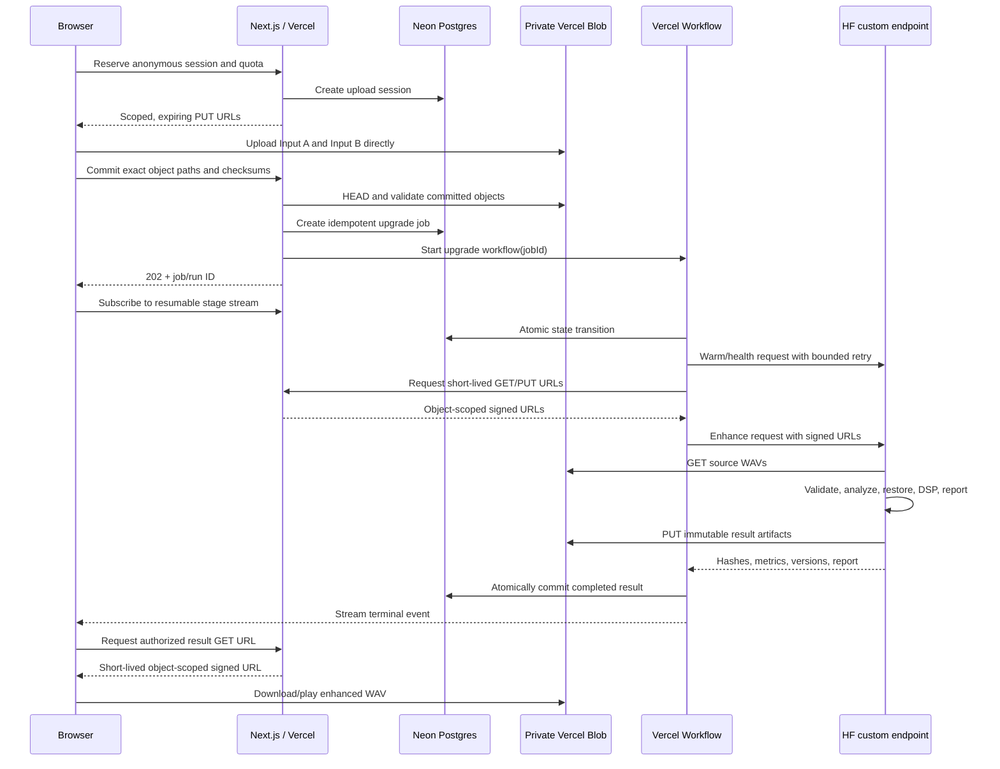

# Signal Enhancer — Architecture

## Decision summary

Signal Enhancer uses a monorepo-shaped repository with two deployable surfaces:

- **Next.js 16 App Router on Vercel** for the product UI, capture orchestration, private upload authorization, durable workflow, status stream, quota enforcement, and result delivery.
- **A custom FastAPI container on Hugging Face Inference Endpoints** for versioned audio analysis, speech restoration, restrained DSP, and result generation.

The first production region is Europe:

- Vercel Functions/Workflow: `dub1` where configurable;
- Vercel Blob: an EU private store;
- Neon Postgres through the Vercel Marketplace in an EU region;
- Hugging Face Inference Endpoint: AWS `eu-west-1`.

## Request and data flow

Audio bytes never transit an ordinary Vercel Function.

## Web stack

- Next.js `16.2.12`, React `19.2.8`, Node `24.x` in production.
- TypeScript with strict mode and exact contracts validated by Zod.
- CSS custom properties and a small global component-class layer for the visual system; no runtime styling dependency.
- Server Components by default; client boundaries are limited to media capture, Web Audio, canvas plots, and workflow state.
- Vitest for unit/integration tests and Playwright for the browser journey.
- `workflow` DevKit for durable multi-step orchestration and resumable progress streams.

Versions are pinned in the lockfile. “Latest” never means floating production dependencies.

## Browser audio subsystem

- `navigator.mediaDevices.getUserMedia()` and `enumerateDevices()` for permission and device discovery.
- Requested constraints are conservative; actual `MediaStreamTrack.getSettings()` values are displayed separately.
- One `AudioContext` and deterministic decoded reference buffer are reused across both captures.
- An `AudioWorklet` captures PCM without blocking the main thread.
- A versioned AudioWorklet records PCM off the main thread; bounded browser helpers encode mono RIFF/WAVE and calculate analysis frames.
- Absolute and loudness-matched traces are derived independently so normalized comparison never replaces the original evidence.
- The browser computes the first reveal before any upload.
- A local `OfflineAudioContext` produces a clearly labelled DSP preview after Upgrade Signal is pressed.

## Private object storage

Use a dedicated private Vercel Blob store. Signed URLs introduced in 2026 allow object- and operation-scoped access without sharing the store-wide token.

- PUT URL: one generated pathname, `audio/wav`, exact maximum size, 10-minute expiry.
- GET/HEAD URL: one pathname, five-minute expiry.
- Result PUT URL: deterministic attempt-scoped pathname, five-minute expiry.
- Immutable objects; no overwrite in normal processing.
- An authoritative `HEAD` verifies committed size and MIME before the job starts; the worker then performs bounded RIFF/WAVE validation before inference.
- Delete originals, previews, results, and reports after 24 hours through the authenticated cleanup route. Live launch requires an hourly-or-faster scheduler; the safe Hobby demo uses daily no-op housekeeping because it stores no server audio.
- Never log signed URLs, Blob tokens, or request bodies.

Initial maximum WAV size is 4 MiB for a 20-second mono 48 kHz PCM16 clip plus safe overhead. Server validation rejects non-WAV content even when MIME and filename appear valid.

## Durable jobs and status

Vercel Workflow owns orchestration because the process is multi-step, retryable, and must survive page reloads and deployments. Neon remains the product source of truth.

Job states:

`queued → warming → processing → completed`

Terminal states:

`failed | expired | cancelled`

Workflow events carry a monotonically increasing sequence and one of the seven product stages. The browser consumes a resumable NDJSON/SSE-compatible stream and reconnects with the last event index. `GET /api/jobs/:id` is the fallback polling endpoint.

Workflow step rules:

- Publish only serializable IDs and metadata, never tokens or audio bytes.
- Job reservation is idempotent per session and output paths are immutable per attempt.
- A transaction and advisory lock serialize global quota reservation.
- Retry network failures and HTTP 429/502/503 with capped backoff.
- Treat malformed audio, schema errors, and other deterministic 4xx responses as fatal.
- The workflow records one terminal result or one sanitized failure for the session-scoped job.
- Cancellation is best effort. A running inference may finish after cancellation, so endpoint concurrency remains capped during beta.

## Data model

### `experiment_sessions`

- `id`, `public_id`, `status`
- signed-session hash and coarse abuse key hash
- reference sample ID/version
- Input A/B reported and user-confirmed device metadata
- requested and reported capture constraints
- created/updated/expiry timestamps

### `captures`

- session ID and `A | B`
- immutable Blob pathname, bytes, SHA-256
- codec, duration, sample rate, channels
- absolute and normalized metrics JSON
- created/expiry timestamps

### `upgrade_jobs`

- session ID, workflow run ID, state, attempt count
- selected source (`A` in v1)
- routing decision and pipeline/model versions
- input/result/report/difference Blob pathnames and hashes
- sanitized error code/message
- created/started/completed/expiry timestamps

### `job_events`

- job ID, monotonic sequence, stage, status, safe detail, timestamp

### `usage_ledger`

- anonymous session hash, coarse network hash, day bucket
- reserved/completed/failed job counters and decoded seconds

## Hugging Face endpoint

Use a custom, non-root `linux/amd64` FastAPI container. Hugging Face mounts pinned model artifacts at `/repository`.

Endpoints:

- `GET /health` — 200 only after model and DSP components are ready.
- `GET /version` — immutable build, model, and pipeline revisions.
- `POST /v1/enhance` — accepts strict job metadata plus object-scoped signed URLs; returns only metadata and hashes.

The worker:

1. creates an isolated temporary directory;
2. downloads only the allowlisted signed Blob URLs supplied by Vercel;
3. validates RIFF/WAVE magic, PCM/float codec, frames, duration, sample rate, channels, decoded sample count, and hashes;
4. analyzes noise floor, clipping, dynamics, high-frequency roll-off, and reverb proxies;
5. routes once to the selected restoration engine;
6. applies restrained high-pass/EQ, gentle compression, de-essing, and loudness match;
7. generates difference data and the transparent report;
8. uploads immutable artifacts through signed PUT URLs;
9. removes all temporary files in `finally` blocks.

The request schema does not accept arbitrary client URLs. The Hugging Face gateway validates its bearer token and the application independently validates `X-Signal-Endpoint-Secret`; neither credential reaches the browser. The worker allowlist includes both the exact private object host (`<store-id>.private.blob.vercel-storage.com`) and the signed PUT control-plane host (`blob.vercel-storage.com`).

## Model policy

### MVP: Resemble Enhance

- Primary speech restoration candidate.
- Pin upstream source commit and Hugging Face model revision.
- Preserve the MIT notices.
- Treat generative bandwidth restoration as inference, not recovered fact.
- Gate release on blind listening tests for speech identity and word preservation.

### Feature-flagged fallback: DeepFilterNet3

- Suitable for faster 48 kHz denoising and a future CPU path.
- Keep in a separate runtime image because its stable dependency line requires NumPy `<2`.
- Do not cascade it with Resemble by default.

### Deferred: VoiceFixer

Its large image, broad dependency surface, checkpoint attribution requirements, and weaker release discipline make it unsuitable for the initial production path. It remains an offline benchmark candidate only.

## Scale-to-zero and warming

- Early beta: NVIDIA L4, min replicas 0, max 1.
- A best-effort warm request starts when the second capture begins, after session and quota checks.
- Workflow still handles both 502 and 503 startup responses and uses a bounded scale-up timeout.
- Never promise a precise ETA. Record cold/warm latency and real-time factor.
- Paid-SLA mode can switch to min 1 only after measured demand justifies the standing cost.

## Abuse and cost controls

- Signed anonymous session, one deep upgrade per session.
- Transactional quota reservation in Postgres before upload authorization.
- Application caps: one active job/session, 100 global jobs/day initially, one in-flight GPU job for one replica.
- Vercel WAF rules are introduced log-first, then tested in preview, then published by the owner.
- Environment-configurable global circuit breaker stops issuing uploads and jobs before a daily spend limit is exceeded.
- HF endpoint max replicas stays at one during beta.
- No endpoint token, Blob token, database URL, or signed media URL reaches the browser.

## Observability

- Structured JSON logs with request/job correlation IDs and no media URLs.
- Vercel runtime/workflow traces for control-plane latency.
- Worker metrics: cold/warm start, download, validation, analysis, model, DSP, upload, real-time factor, peak VRAM/RAM, retry outcome.
- Product metrics: permission success, capture completion, reveal reached, upgrade reserved/completed/failed, timeout fallback.
- Error messages shown to users are mapped from stable safe error codes.

## Deployment pipeline

The checked-in GitHub Actions foundation runs:

1. web lint, typecheck, unit tests, and production build;
2. the prepared desktop and mobile Playwright journey;
3. worker lint, typecheck, unit tests, and a locked container build.

Before promoting live inference, the release workflow must additionally produce an SBOM, scan the built digest, publish that immutable digest, and smoke-test it before updating the endpoint. Those paid/live promotion steps are intentionally not triggered by the initial demo pipeline.

Production changes pin the container digest and model commit. The endpoint update remains a deliberate environment promotion, not a floating “latest” deploy.

## Environment contract

See `.env.example`. Live mode must fail closed when any required secret or integration is absent. Demo/local UI work may run with `SIGNAL_MODE=demo`, but it must never label the local DSP preview as AI restoration.
